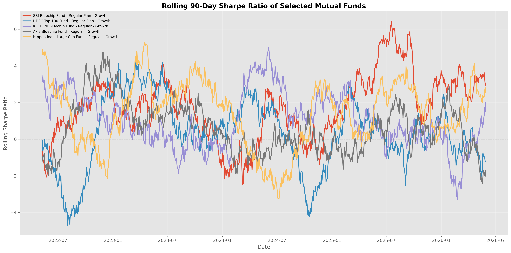
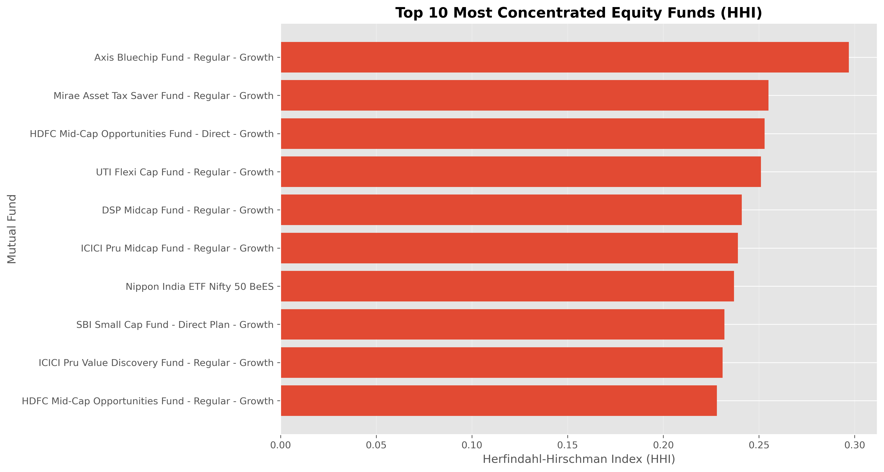

# 📊 Mutual Fund Analytics Platform

> **Bluestock Fintech Internship Capstone Project**  
> A complete Mutual Fund Analytics platform built using **Python, SQL, and Power BI** to analyze mutual fund performance, investor behavior, portfolio risk, and industry trends.

---

# 📷 Dashboard Preview

## 🏠 Industry Overview


---

## 📈 Fund Performance Dashboard


---

## 👥 Investor Analytics Dashboard


---


## 📌 Project Overview

This project analyzes Indian mutual fund data through an end-to-end analytics pipeline, covering:

- Data Cleaning & Preprocessing
- SQL Database Design
- Exploratory Data Analysis (EDA)
- Performance & Risk Analytics
- Power BI Dashboard
- Advanced Analytics
- Mutual Fund Recommendation System

The objective is to transform raw mutual fund datasets into meaningful insights for investors and fund managers.

---

## 🚀 Features

### 📈 Data Analytics
- Cleaned and validated 10 mutual fund datasets
- Exploratory Data Analysis (EDA)
- NAV trend analysis
- AUM growth analysis
- SIP inflow trends
- Category inflow analysis
- Investor demographics
- Portfolio allocation analysis

### 📊 Performance Analytics
- Daily Return Calculation
- CAGR (1Y / 3Y / 5Y)
- Alpha & Beta
- Sharpe Ratio
- Sortino Ratio
- Maximum Drawdown
- Fund Scorecard
- Benchmark Comparison

### ⚠️ Advanced Risk Analytics
- Historical VaR (95%)
- Conditional VaR (CVaR)
- Rolling 90-Day Sharpe Ratio
- Investor Cohort Analysis
- SIP Continuity Analysis
- Sector HHI Concentration
- Rule-Based Fund Recommendation System

## 📊 Advanced Analytics

### Rolling 90-Day Sharpe Ratio



### Sector HHI Concentration


---


### 📉 Dashboard (Power BI)
- Industry Overview
- Fund Performance
- Investor Analytics
- SIP & Market Trends
---


## 🛠 Tech Stack

| Category | Technologies |
|----------|--------------|
| Language | Python |
| Libraries | Pandas, NumPy, Matplotlib, Seaborn |
| Database | SQLite |
| Dashboard | Power BI |
| IDE | Jupyter Notebook, VS Code |
| Version Control | Git & GitHub |

---

# 📁 Project Structure

```text
Mutual-Fund-Analytics-Bluestock/
│
├── dashboard/
│   ├── assets/
│   │   ├── icons/
│   │   └── bluestock_logo.png
│   ├── Dashboard images/
│   ├── bluestock_mf_dashboard.pbix
│   ├── Dashboard.pdf
│   └── Dashboard_Theme.json
│
├── data/
│   ├── processed/
│   └── raw/
│
├── notebooks/
│   ├── day1_analysis.ipynb
│   ├── EDA_Analysis.ipynb
│   ├── Performance_Analytics.ipynb
│   └── Advanced_Analytics.ipynb
│
├── reports/
│   ├── charts/
│   ├── alpha_beta.csv
│   ├── cagr_comparison.csv
│   ├── cohort_analysis.csv
│   ├── fund_scorecard.csv
│   ├── max_drawdown.csv
│   ├── nav_returns.csv
│   ├── rolling_sharpe_summary.csv
│   ├── sector_hhi.csv
│   ├── sharpe_ratio.csv
│   ├── sip_continuity.csv
│   ├── sortino_ratio.csv
│   ├── var_cvar_report.csv
│   └── tracking_error.csv
│
├── scripts/
│   └── recommender.py
│
├── sql/
├── bluestock_mf.db
├── README.md
└── .gitignore
```

---

# 📚 Datasets

The project uses **10 cleaned datasets**:

| Dataset |
|----------|
| Fund Master |
| NAV History |
| AUM by Fund House |
| Monthly SIP Inflows |
| Category Inflows |
| Industry Folio Count |
| Scheme Performance |
| Investor Transactions |
| Portfolio Holdings |
| Benchmark Indices |

---

# 📅 Project Progress

## ✅ Day 1
- Project Setup
- Data Loading
- Initial Exploration

## ✅ Day 2
- Data Cleaning
- Missing Value Handling
- SQLite Database Creation

## ✅ Day 3
- Exploratory Data Analysis
- Industry Insights
- Investor Analytics

## ✅ Day 4
- Performance Analytics
- Risk Metrics
- Fund Scorecard

## ✅ Day 5
- Interactive Power BI Dashboard
- KPI Cards
- Investor Dashboard
- Market Trend Dashboard

## ✅ Day 6
- Historical VaR & CVaR
- Rolling Sharpe Ratio
- Investor Cohort Analysis
- SIP Continuity Analysis
- Sector HHI
- Mutual Fund Recommender

---

# 📊 Reports Generated

- Fund Scorecard
- Alpha & Beta Report
- Sharpe Ratio Report
- Sortino Ratio Report
- CAGR Comparison
- Maximum Drawdown
- Historical VaR & CVaR
- Sector HHI Analysis
- Investor Cohort Analysis
- SIP Continuity Report

---

# 📷 Dashboard Preview

> Dashboard screenshots are available inside:

```text
dashboard/Dashboard images/
```

---

# ▶️ How to Run

### Clone Repository

```bash
git clone https://github.com/Utsav-Ratpiya/Mutual-Fund-Analytics-Bluestock.git
```

### Install Dependencies

```bash
pip install pandas numpy matplotlib seaborn jupyter
```

### Launch Notebook

```bash
jupyter notebook
```

### Run Recommendation System

```bash
cd scripts
python recommender.py
```

---

# 🎯 Future Improvements

- Machine Learning based Fund Recommendation
- Portfolio Optimization
- Real-Time NAV Integration
- Streamlit Web Dashboard
- Predictive Risk Analytics

---

# 👨‍💻 Author

**Utsav Ratpiya**

B.Tech CSE (AI & ML)  
Adani University

**Bluestock Fintech Internship – Capstone Project**

---

## ⭐ If you found this project useful, consider giving it a star!