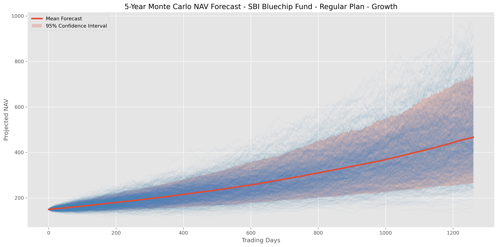
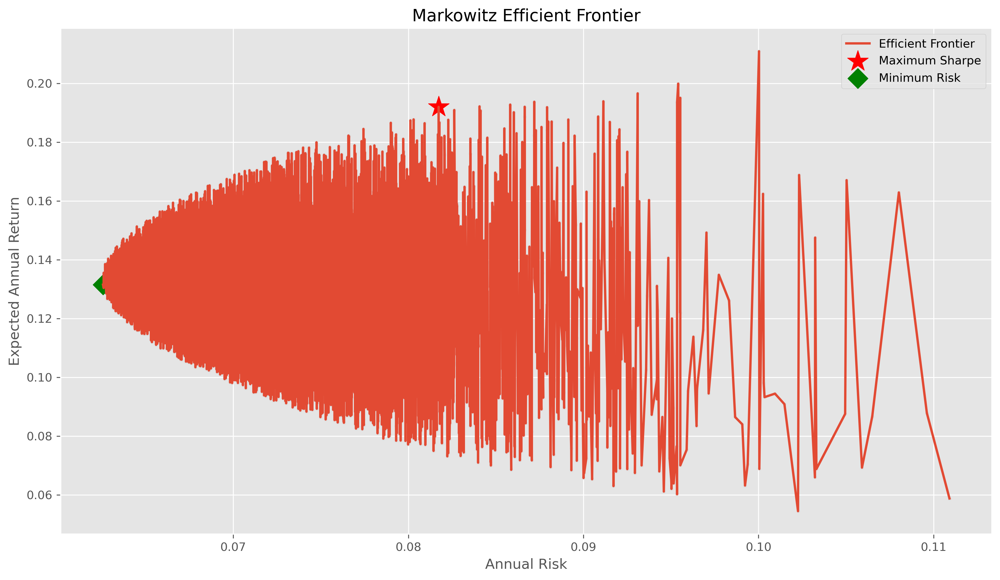

# 📊 Mutual Fund Analytics Platform

> **Bluestock Fintech Internship Capstone Project**  
> A complete Mutual Fund Analytics platform built using **Python, SQL, and Power BI** to analyze mutual fund performance, investor behavior, portfolio risk, and industry trends.

---

# 📷 Interactive Power BI Dashboard

## 🏠 Industry Overview


---

## 📊 Fund Performance Dashboard


---

## 👥 Investor Analytics Dashboard


---

## 📈 SIP And Market Trend Dashboard


---

## 🔄 Project Workflow

```text
Raw Datasets
      │
      ▼
Data Ingestion
      │
      ▼
Data Cleaning
      │
      ▼
SQLite Database
      │
      ▼
EDA
      │
      ▼
Performance Analytics
      │
      ▼
Power BI Dashboard
      │
      ▼
Advanced Analytics
      │
      ▼
Recommendation System
```


## 📌 Project Overview

This project presents a complete end-to-end Mutual Fund Analytics Platform developed during the Bluestock Fintech Capstone Internship.

The platform automates the entire analytics lifecycle—from raw data ingestion and preprocessing to database creation, advanced financial analytics, interactive dashboard development, and investment decision support.

### The project includes:

- Automated ETL Pipeline
- SQLite Data Warehouse
- Exploratory Data Analysis (EDA)
- Performance & Risk Analytics
- Interactive Power BI Dashboard
- Advanced Financial Analytics
- Rule-Based Mutual Fund Recommendation System
- Monte Carlo NAV Simulation
- Markowitz Portfolio Optimization

The objective is to transform raw mutual fund datasets into actionable investment insights for investors, analysts, and fund managers through data-driven decision making.
---

## 🚀 Features

### 📂 Data Engineering

- Automated ETL Pipeline
- Data Validation
- Missing Value Handling
- Duplicate Detection
- SQLite Database Generation
- Logging & Error Handling

### 📊 Exploratory Data Analysis

- NAV Trend Analysis
- AUM Growth Analysis
- SIP Trend Analysis
- Category Inflow Analysis
- Investor Demographics
- Portfolio Allocation
- Correlation Analysis
- Geographic Analysis

### 📈 Performance Analytics

- Daily Returns
- CAGR (1Y / 3Y / 5Y)
- Alpha
- Beta
- Sharpe Ratio
- Sortino Ratio
- Tracking Error
- Maximum Drawdown
- Fund Scorecard

### 📉 Dashboard (Power BI)
- Industry Overview
- Fund Performance
- Investor Analytics
- SIP & Market Trends

### ⚠️ Advanced Analytics

- Historical VaR (95%)
- Conditional VaR (CVaR)
- Rolling 90-Day Sharpe
- Investor Cohort Analysis
- SIP Continuity Analysis
- Sector HHI Concentration
- Rule-Based Fund Recommendation

### 🎯 Bonus Analytics

- Monte Carlo Simulation (5-Year NAV Projection)
- Markowitz Portfolio Optimization
- Efficient Frontier
- Maximum Sharpe Portfolio
- Minimum Risk Portfolio

## 📊 Advanced Analytics

### Rolling 90-Day Sharpe Ratio


### Monte Carlo Simulation



### Portfolio Optimization



### Sector HHI Concentration


---


## 🛠 Tech Stack

| Category | Technologies |
|----------|--------------|
| Language | Python |
| Libraries | Pandas, NumPy, Matplotlib, Seaborn, Plotly, SQLAlchemy, Requests |
| Database | SQLite |
| Dashboard | Power BI |
| IDE | Jupyter Notebook, VS Code |
| Version Control | Git & GitHub |

---

# 📁 Project Structure

```text
Mutual-Fund-Analytics-Bluestock/
│
├── dashboard/
│   ├── Dashboard images/
│   │   ├── industry_overview.png
│   │   ├── fund_performance.png
│   │   ├── investor_analytics.png
│   │   ├── sip&market_trend.png
│   │   └── home.png
│   │
│   ├── Dashboard.pdf
│   ├── Dashboard_Theme.json
│   └── bluestock_mf_dashboard.pbix
│
│
├── data/
│   │
│   ├── raw/
│   │   ├── 01_fund_master.csv
│   │   ├── ...
│   │   └── 10_benchmark_indices.csv
│   │
│   ├── processed/
│   │    ├── 01_fund_master_cleaned.csv
│   │    ├── ...
│   │    └── 10_benchmark_indices_cleaned.csv
│   │    
│   └── db/
│        └── bluestock_mf.db
│
│
├── notebooks/
│   ├── 01_Data_Ingestion.ipynb
│   ├── 02_Data_Cleaning.ipynb
│   ├── 03_EDA_Analysis.ipynb
│   ├── 04_Performance_Analytics.ipynb
│   ├── 05_Advanced_Analytics.ipynb
│   ├── 06_Monte_Carlo_Simulation.ipynb
│   └── 07_Portfolio_Optimization.ipynb
│
│
├── logs/
│   └── etl_pipeline.log
│
├── reports/
│   ├── charts/
│   │   ├── rolling_sharpe_chart.png
│   │   ├── sector_hhi_concentration.png
│   │   ├── nav_trend.png
│   │   ├── ...
│   │   ├── sip_trend.png
│   │   ├── rolling_sharpe_chart.png
│   │   ├── monte_carlo_simulation.png
│   │   ├── monte_carlo_distribution.png
│   │   ├── efficient_frontier.png
│   │   ├── risk_return_scatter.png
│   │   └── sector_hhi_concentration.png
│   │
│   ├── alpha_beta.csv
│   ├── cagr_comparison.csv
│   ├── cohort_analysis.csv
│   ├── fund_scorecard.csv
│   ├── max_drawdown.csv
│   ├── nav_returns.csv
│   ├── rolling_sharpe_summary.csv
│   ├── sector_hhi.csv
│   ├── sharpe_ratio.csv
│   ├── sip_continuity.csv
│   ├── sortino_ratio.csv
│   ├── tracking_error.csv
│   ├── var_cvar_report.csv
│   ├── monte_carlo_summary.csv
│   └── optimal_portfolio.csv
│
├── scripts/
│   ├── etl_pipeline.py
│   ├── create_database.py
│   ├── data_cleaning.py
│   ├── data_ingestion.py
│   ├── database_loader.py
│   ├── live_nav_fetch.py
│   ├── recommender.py
│   ├── run_queries.py
│   ├── validate_amfi_code.py
│   └── verify_database.py
│
├── sql/
│   ├── schema.sql
│   └── queries.sql
│
├── requirements.txt
├── README.md
└── .gitignore

---

## ⚙️ Automated ETL Pipeline

The project includes a production-style ETL pipeline that automates the complete data workflow.

### Pipeline Stages

```
Raw Data
    ↓
Data Ingestion
    ↓
Data Cleaning
    ↓
SQLite Database Creation
    ↓
Database Validation
    ↓
Analytics & Dashboard

```

### Features

- Automated data ingestion
- Data quality validation
- Data cleaning & preprocessing
- SQLite database generation
- Row count verification
- Logging support
- Error handling


# 📚 Datasets

The project uses **10 cleaned datasets**:

| Dataset |
|----------|
| Fund Master |
| NAV History |
| AUM by Fund House |
| Monthly SIP Inflows |
| Category Inflows |
| Industry Folio Count |
| Scheme Performance |
| Investor Transactions |
| Portfolio Holdings |
| Benchmark Indices |

---

# 📅 Project Milestones

## ✅ Phase 1 — Data Engineering
- Data Ingestion
- Data Cleaning
- ETL Pipeline
- SQLite Database

## ✅ Phase 2 — Data Analysis
- Exploratory Data Analysis
- Performance Analytics
- Risk Metrics

## ✅ Phase 3 — Dashboard Development
- Interactive Power BI Dashboard
- KPI Cards
- Drill-through Pages
- Interactive Filters

## ✅ Phase 4 — Advanced Analytics
- Historical VaR
- CVaR
- Rolling Sharpe
- Investor Cohort Analysis
- SIP Continuity
- Sector HHI
- Recommendation System

## ✅ Phase 5 — Bonus Analytics
- Monte Carlo Simulation
- Markowitz Portfolio Optimization

---

# 📊 Reports Generated

- Fund Scorecard
- Alpha & Beta
- Sharpe Ratio
- Sortino Ratio
- CAGR Comparison
- Tracking Error
- Maximum Drawdown
- Historical VaR & CVaR
- Rolling Sharpe Summary
- Investor Cohort Analysis
- SIP Continuity Analysis
- Sector HHI Report
- Monte Carlo Summary
- Optimal Portfolio Allocation

---

# 📷 Dashboard Preview

> Dashboard screenshots are available inside:

```text
dashboard/Dashboard images/
```

---

# ▶️ How to Run

### Clone Repository

```bash
git clone https://github.com/Utsav-Ratpiya/Mutual-Fund-Analytics-Bluestock.git
```

### Install Dependencies

```bash
pip install -r requirements.txt
```

### Run ETL Pipeline

```bash
cd scripts
python etl_pipeline.py
```

### Run Recommendation System

```bash
python recommender.py
```

### Launch Jupyter Notebook

```bash
jupyter notebook
```

### Open Power BI Dashboard

```bash
dashboard/bluestock_mf_dashboard.pbix
```

---

# 🎯 Future Improvements


- Streamlit Web Dashboard
- Automated HTML Email Reports
- Live Portfolio Tracking
- Scheduled ETL Pipeline
- Cloud Deployment

---

### Result

- Real-Time NAV Integration using MFAPI
- Streamlit Web Dashboard
- Automated HTML Email Reports
- Live Portfolio Tracking
- Machine Learning Based Fund Recommendation
- Scheduled ETL Pipeline
- Cloud Deployment

---

# 👨‍💻 Author

**Utsav Ratpiya**

B.Tech CSE (AI & ML)  
Adani University

**Bluestock Fintech Internship – Capstone Project**

---

## ⭐ If you found this project useful, consider giving it a star!